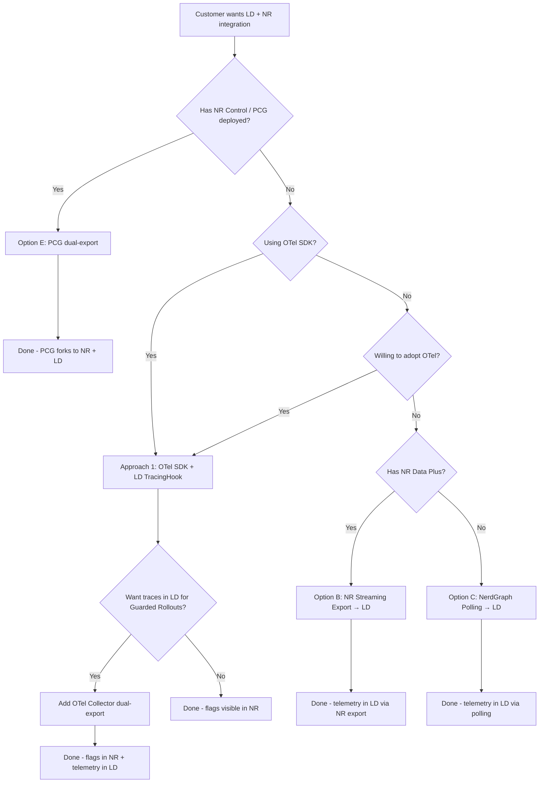
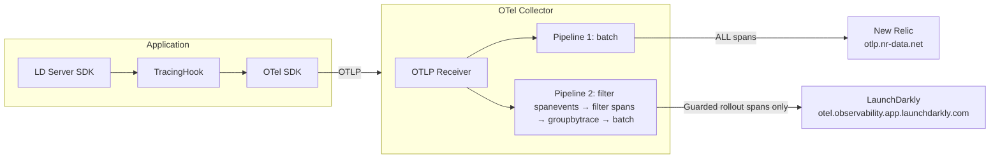
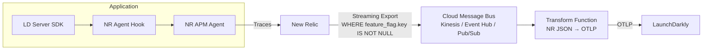
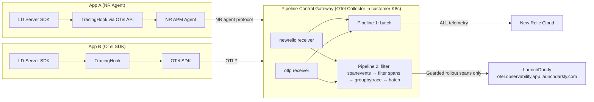
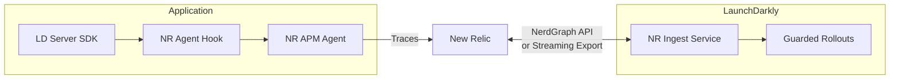
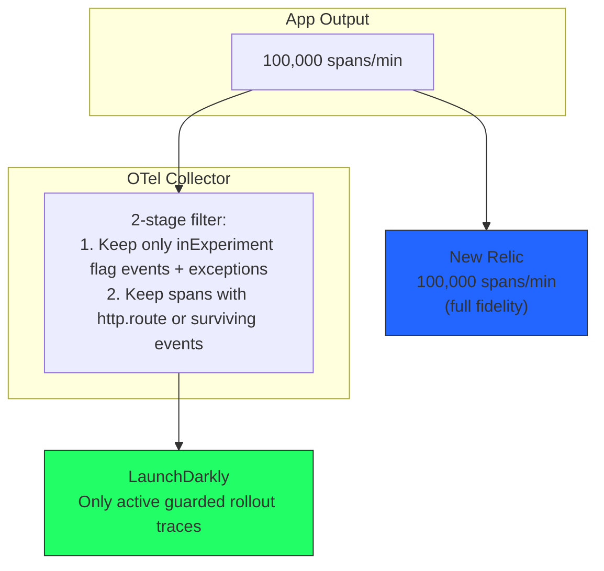
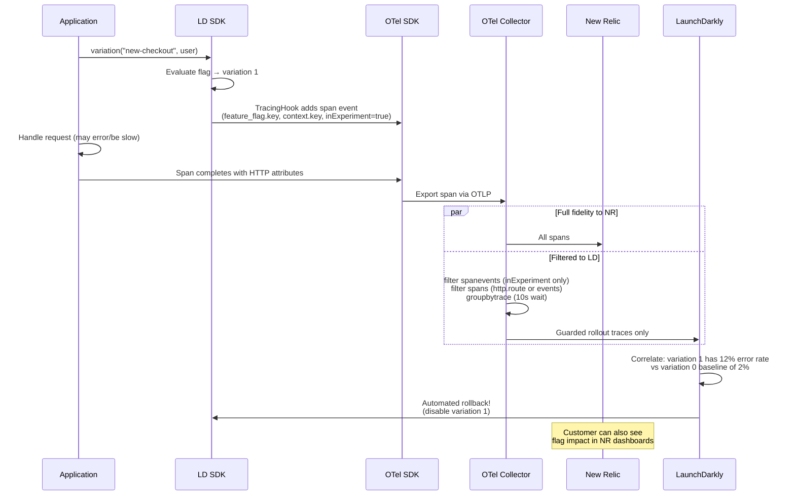

# LaunchDarkly + New Relic Integration Diagrams

## Decision Flowchart

## Option A: OTel Collector Dual-Export

## Option B: New Relic Streaming Export

## Option E: Pipeline Control Gateway (PCG)

## Option D: LD New Relic Ingest Service

## Volume Comparison

## End-to-End: Guarded Rollout with New Relic

